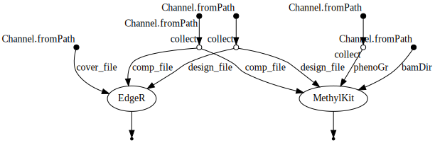
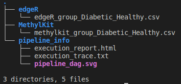

# DiffMethSeq
A NextFlow pipeline to perform differential methylation analysis from bismark-aligned files

**NOTE: UNDER DEVELOPMENT**

- [Description](#description)
- [Workflow](#workflow)
- [Running Environment](#running-environment)
  - [Conda](#using-conda)
  - [Docker](#using-docker)
  - [Singularity/Apptainer](#using-singularityapptainer)
- [Input files and paths](#input-files-and-paths)
- [How to run](#how-to-run)
- [Results](#results)        


## Description

## Workflow


## Running environment
Please update the selected environment in the `nextflow.config` file.

### Using Conda
Conda can be used to run the pipeline. **[update with yaml file- working]**

### Using Docker
Build the docker image using the `Dockerfile`. Default in `nextflow.config` will use `jd21/r-nf:240129`.

```
cd env
docker build -t <USERNAME>/<tags> .
```

### Using Singularity/Apptainer
Docker image can be directly used in the Singularity/Apptainer (no need to build an apptainer image for now). User can use the same docker image `jd21/r-nf:240129` pull using the apptainer by changing the `nextflow.config`.

## Input files and paths

1. **formatted_designfile** (required): (.tsv) with columns, *'Sample_ID'*, *'input_R1'*, *'input_R2'*, *'ip_R1'*, *'ip_R2'*, *'Group_ID'* \
2. **compare_string** (required): *'treated_vs_control'* (or whatever group you have to compare)\
3. **cov_dir** (required for **edgeR** analysis): Path to the directory of *bismark*-generated zipped coverage files (deduplicated and sorted, if required). \
4. **bam_dir** (required for **MethylKit** analysis): Path to the directory of *bismark*-generated bam files. \
5. **phenoGroup** (required for **MethylKit** analysis): to know the group information, e.g. if you have 6 samples, like 'control', 'patient', 'control', 'patient', 'control', 'patient', then the file needs a line like this - `c(0,1,0,1,0,1,0,1)`.

**NOTE**: It is possible to run either `EdgeR` or `MethylKit`.

## How to run
1. Load Nextflow module: `ml nextflow-23.10.1`
2. docker installation required
3. Load Singularity module: `ml singularity-3.8.3`

```
# differential methylation analysis
nextflow run main.nf -profile docker \
    --formatted_designfile ./data/Sample_sheet.csv \
    --compare_str ./data/comparefile.txt \
    --cov_dir data/ \
    --bam_dir <PATH/TO/FOLDER>/bismark/deduplicated/sorted_bam/ \ 
    --phenoGroup ./data/treatment.txt
```

## Results

The pipeline will generates three directories
- edgeR
- MethylKit
- pipeline_info



## Credits
- Main Author: 
    - Jyotirmoy Das ([@JD2112](https://github.com/JD2112))

- Collaborators:

## Citation

Das, J. (2025). DiffMethSeq (v1.0.0). Zenodo. [https://doi.org/10.5281/zenodo.14762150](https://doi.org/10.5281/zenodo.14762150)

## HELP/FAQ/Troubleshooting

Please create [issues](https://github.com/JD2112/DiffMethSeq/issues) on github.


## Acknowledgement

We would like to acknowledge the **Core Facility, Faculty of Medicine and Health Sciences, Linköping University, Linköping, Sweden** and **Clinical Genomics Linköping, Science for Life Laboratory, Sweden** for their support.
